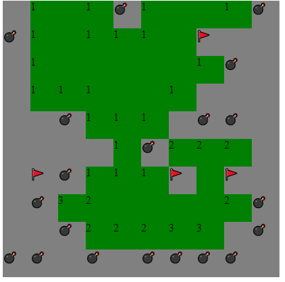

# Minesweeper
Minesweeper is a single-player puzzle video game. The objective of the game is to clear a rectangular board containing hidden "mines" or bombs without detonating any of them, with help from clues about the number of neighbouring mines in each field. 

## How to run it
1. fork or download the repo
2. run index.html

## Features
- Full functional game (Flags , bombs , clicks)
- win and lose indication

## Future Features
- Better FrontEnd and visualization

## How does it look like

